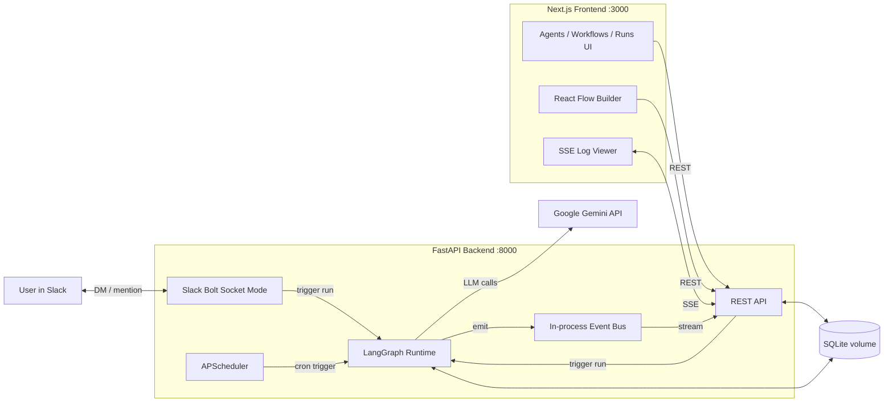

# Yuno — AI Agent Orchestration Platform

Local-first platform for building, running, and monitoring multi-agent workflows. Design graphs visually in the browser, execute them with LangGraph + Gemini, trigger runs from the UI or Slack, and watch live logs stream over SSE.

## Architecture



## Stack & why

| Layer | Choice | Why |
|-------|--------|-----|
| Runtime | **LangGraph** | Native graph model with conditional edges — maps 1:1 to the visual builder |
| Backend | **Python + FastAPI** | Best Gemini / LangGraph / Slack SDK ecosystem; typed routes + SSE |
| Frontend | **Next.js + React Flow + shadcn/ui** | Canonical node-edge editor; polished minimal UI |
| Database | **SQLite + SQLModel** | Zero-config local-first persistence |
| Channel | **Slack Bolt (Socket Mode)** | No public URL or ngrok — works from Docker |
| LLM | **Gemini** (`langchain-google-genai`) | Fast, capable default (`gemini-2.0-flash`); per-agent model override |
| Live logs | **SSE** | Simple one-way streaming for run monitoring |

## Prerequisites

- Docker & Docker Compose
- [Google AI Studio](https://aistudio.google.com/) API key (`GEMINI_API_KEY`)
- [Tavily](https://tavily.com/) API key (`TAVILY_API_KEY`) — used by the `web_search` agent tool
- Slack app tokens (optional — backend boots without them; Slack channel disabled)

## Quick start

```bash
cp .env.example .env
# Edit .env: set GEMINI_API_KEY, TAVILY_API_KEY, and Slack tokens

docker compose up --build
open http://localhost:3000
```

Backend seeds two workflow templates on first boot: **Research & Reply** and **Support Triage**.

## Slack app setup

1. Create an app at [api.slack.com/apps](https://api.slack.com/apps) → **Create New App** → **From a manifest**.
2. Paste the manifest below (adjust name/display).
3. Install the app to your workspace.
4. Copy tokens into `.env`:
   - **SLACK_BOT_TOKEN** — OAuth & Permissions → Bot User OAuth Token (`xoxb-…`)
   - **SLACK_APP_TOKEN** — Basic Information → App-Level Tokens → create with `connections:write` (`xapp-…`)
   - **SLACK_SIGNING_SECRET** — Basic Information → Signing Secret
5. Enable **Socket Mode** (Settings → Socket Mode → ON).
6. Invite the bot to a channel or DM it directly.

**Required bot scopes:** `app_mentions:read`, `chat:write`, `im:history`, `im:read`, `im:write`

**Minimal manifest:**

```yaml
display_information:
  name: Yuno Agent Bot
  description: Triggers Yuno workflows from Slack
features:
  bot_user:
    display_name: Yuno
    always_online: true
oauth_config:
  scopes:
    bot:
      - app_mentions:read
      - chat:write
      - im:history
      - im:read
      - im:write
settings:
  event_subscriptions:
    bot_events:
      - app_mention
      - message.im
  interactivity:
    is_enabled: false
  org_deploy_enabled: false
  socket_mode_enabled: true
  token_rotation_enabled: false
```

**Binding workflows:** set a workflow's **Slack Channel** field to the channel ID, `#channel-name`, or `*` for any channel/DM.

## Demo walkthrough

### Research & Reply (UI)

1. Open **Workflows** → **Research & Reply** → **Open Editor**.
2. Click **Run**, enter a question (e.g. “What is LangGraph?”).
3. Open the run detail page — watch the **Live Logs** SSE stream and **Message Timeline**.
4. The graph runs **Researcher** (web tools) → **Writer** (summary bullets).

### Research & Reply (Slack)

1. Set the workflow's Slack channel to `*` or your DM channel ID.
2. DM the bot: “Summarize the latest news about AI agents.”
3. The bot replies in-thread when the run completes.

### Support Triage (UI)

1. Open **Support Triage** → **Run** with:
   - “The login button crashes” → routes to **Bug Triager**
   - “How do I export data?” → routes to **Product Answerer**
2. On the canvas, conditional edges (`when: label == 'bug'`) show routing visually.

### Support Triage (Slack)

Mention the bot in a channel or DM with a bug report or product question — the classifier routes automatically.

## Running tests

```bash
# Docker
docker compose run --rm backend pytest -v

# Local (from backend/)
cd backend
python -m venv .venv && source .venv/bin/activate
pip install -r requirements.txt
pytest -v
```

Tests mock Gemini — no real API keys required.

## Extend the platform

### Add a workflow template

Edit `backend/app/seed/templates.py`:

1. Define agents (`Agent(...)` with prompts, tools, guardrails).
2. Build a graph dict (`nodes` + `edges` with `source`/`target` and optional `when`).
3. Append a `Workflow(...)` to the seed list.

Restart the backend (or delete `data/app.db` for a fresh seed).

### Add a tool

Edit `backend/app/runtime/tools.py`:

1. Implement a `@tool` function.
2. Register it in `TOOL_REGISTRY` and `TOOL_DESCRIPTIONS`.
3. Agents can select it in the UI; it appears on `GET /api/tools`.

### Add a messaging channel

Add a module under `backend/app/channels/` (see `slack.py`):

1. Listen for inbound messages.
2. Find a matching workflow (`Workflow.slack_channel` or your own mapping).
3. Create a `Run` row and call `schedule_run(run_id)` from `app.runtime.runner`.
4. Start/stop the handler from `app/main.py` lifespan.

## Project structure

```
yuno/
├── docker-compose.yml
├── .env.example
├── README.md
├── backend/
│   ├── Dockerfile
│   ├── requirements.txt
│   ├── pytest.ini
│   ├── app/
│   │   ├── main.py              # FastAPI app, seeds, Slack + scheduler
│   │   ├── db.py
│   │   ├── models.py
│   │   ├── api/                 # agents, workflows, runs, stream, stats, tools
│   │   ├── runtime/             # graph, agent_node, runner, tools, llm, events
│   │   ├── channels/slack.py
│   │   ├── seed/templates.py
│   │   └── scheduler.py
│   └── tests/
│       ├── test_agents.py
│       ├── test_workflows.py
│       └── test_runtime.py
└── frontend/
    ├── Dockerfile
    ├── app/                     # Next.js pages (agents, workflows, runs)
    ├── components/              # WorkflowCanvas, RunLogStream, AgentForm, …
    └── lib/                     # api.ts, types.ts
```

## Environment variables

| Variable | Required | Description |
|----------|----------|-------------|
| `GEMINI_API_KEY` | Yes (for real runs) | Google Gemini API key |
| `TAVILY_API_KEY` | Yes (for web search) | Tavily search API key (`tvly-…`) |
| `SLACK_BOT_TOKEN` | No | Bot OAuth token (`xoxb-…`) |
| `SLACK_APP_TOKEN` | No | App-level token for Socket Mode (`xapp-…`) |
| `SLACK_SIGNING_SECRET` | No | Slack signing secret |
| `DATABASE_URL` | No | Default `sqlite:///data/app.db` |
| `NEXT_PUBLIC_API_URL` | No | Frontend → backend URL (default `http://localhost:8000`) |

## API overview

| Method | Path | Description |
|--------|------|-------------|
| GET | `/api/agents` | List agents |
| POST | `/api/workflows/{id}/run` | Trigger a run (`{"input": "..."}`) |
| GET | `/api/runs/{id}` | Run detail (messages + logs) |
| GET | `/api/runs/{id}/stream` | SSE log/message stream |
| GET | `/api/stats` | Dashboard counts |
| GET | `/api/tools` | Available agent tools |
| GET | `/api/models` | Supported Gemini models |
