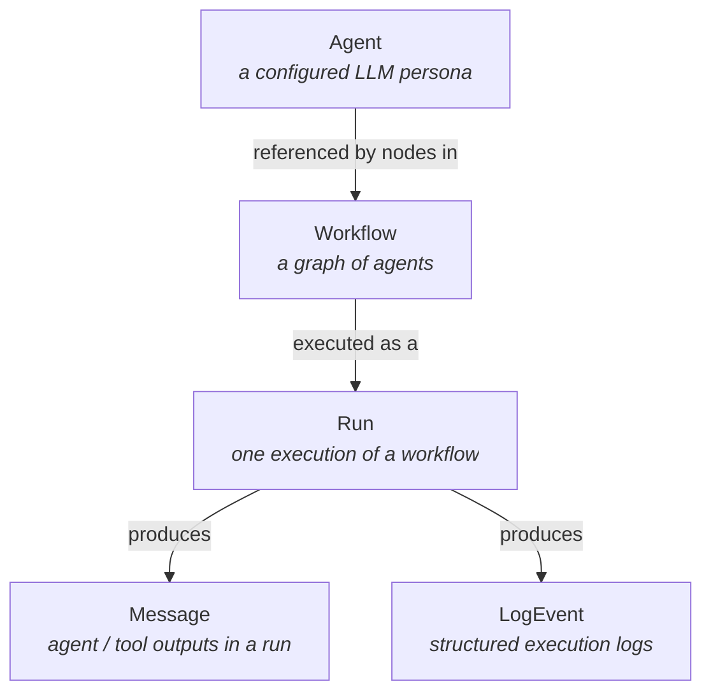
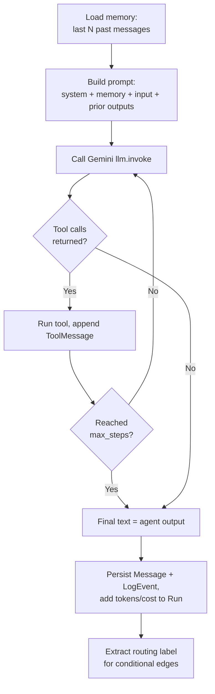
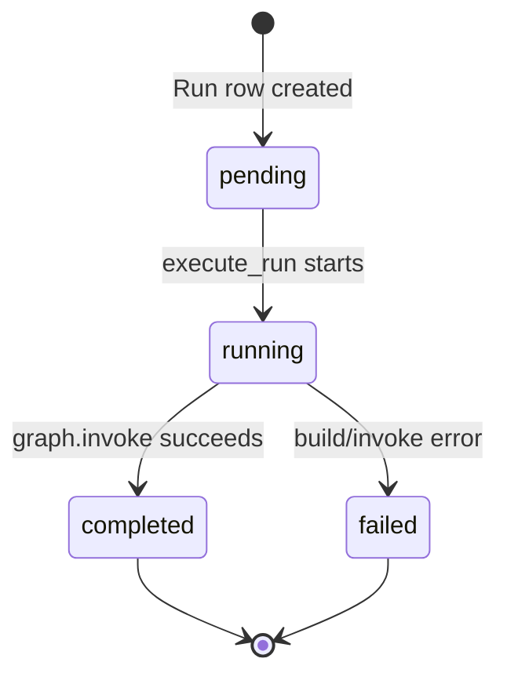
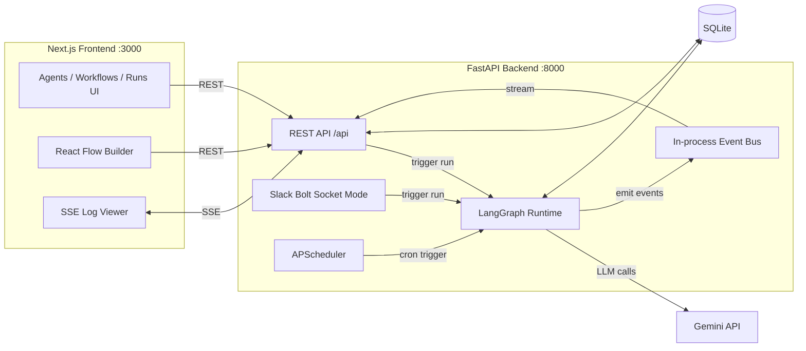
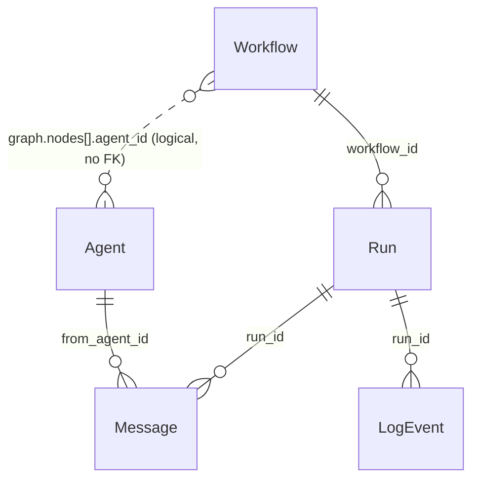

# Yuno (AgentOrca) — Product Understanding

This document explains **how the product is built**, organized by the concepts a user
actually interacts with rather than by raw file layout. The goal is to let a new
engineer (or reviewer) understand "what each part of the product is" and "how the
code makes it happen."

> **One-line summary:** AgentOrca is a local-first platform for **building, running, and
> monitoring multi-agent workflows**. You design a graph of agents visually in the
> browser, execute it with **LangGraph + Google Gemini**, trigger runs from the UI,
> Slack, or a cron schedule, and watch logs stream live over SSE.

---

## 1. The core concepts (mental model)

Everything in the product is built from five primitives. Understanding how they relate
is the key to understanding the whole codebase.



| Concept | What it is | Where it lives |
|---------|-----------|----------------|
| **Agent** | A reusable, saved LLM configuration (prompt + model + tools + guardrails). Not a running process. | `backend/app/models.py` → `Agent` table |
| **Workflow** | A named directed graph (`nodes` + `edges`) that wires agents together with optional conditional routing. | `backend/app/models.py` → `Workflow` table |
| **Run** | A single execution of a workflow with one input. Tracks status, output, tokens, cost. | `backend/app/models.py` → `Run` table |
| **Message** | A single agent/tool output produced inside a run (the conversation trace). | `Message` table |
| **LogEvent** | A structured log line emitted during a run (agent start/done, tool call, error). | `LogEvent` table |

A useful way to hold it in your head:

> An **Agent** is *who*. A **Workflow** is *the plan*. A **Run** is *one time the plan
> was carried out*. **Messages** and **LogEvents** are *the record of what happened*.

The product surface (frontend) maps 1:1 to these concepts: there is an **Agents** page,
a **Workflows** page (with a visual editor), a **Runs** page (with live detail), and a
**Dashboard** that summarizes all of them.

---

## 2. What is an "Agent"?

An **agent is a persisted LLM configuration** — a saved "persona" with a prompt, a
model, a set of tools it may call, and guardrails. It is *not* a long-running service;
it only "comes alive" when a workflow graph references it and a run executes that node.

### 2.1 The data model

```36:57:backend/app/models.py
class AgentBase(SQLModel):
    name: str
    role: str
    system_prompt: str
    model: str = "gemini-2.0-flash"
    tools: list[str] = Field(default_factory=list)
    memory_window: int = 10
    temperature: float = 0.7
    max_tokens: int = 2048
    guardrails: Guardrails = Field(default_factory=Guardrails)
    schedule_cron: Optional[str] = None
    schedule_input: Optional[str] = None
```

Field-by-field meaning:

| Field | Purpose |
|-------|---------|
| `name`, `role` | Human identity used in the UI and in prompt context |
| `system_prompt` | The instruction that defines the agent's behavior |
| `model` | Which Gemini model to use (e.g. `gemini-2.0-flash`) |
| `tools` | Names of tools the agent is allowed to call (`web_search`, `http_get`, `slack_send`, `calculator`) |
| `memory_window` | How many of the agent's *past messages* (across prior runs) to load as memory |
| `temperature`, `max_tokens` | Standard LLM sampling parameters |
| `guardrails` | `blocked_topics` (stored, not yet enforced) + `max_steps` (caps the ReAct loop) |
| `schedule_cron`, `schedule_input` | Optional cron string + input to auto-trigger a workflow on a schedule |

### 2.2 How an agent runs

Agents only execute as **nodes inside a workflow graph**. The execution logic lives in
`backend/app/runtime/agent_node.py` (`run_agent`). Each agent node runs a bounded
**ReAct loop**:



Two important behaviors:

1. **Tool calling** — if the agent has tools, the LLM is given them via
   `llm.bind_tools(tools)`. When Gemini asks to call a tool, the loop executes it,
   feeds the result back, and continues until no more tool calls (or `max_steps`).
2. **Routing labels** — a "classifier" agent can output something like
   `{"label": "bug"}`. That label is written into the graph state so that
   **conditional edges** can branch on it (see workflows below).

### 2.3 Managing agents (UI + API)

- **UI:** `frontend/app/agents/page.tsx` shows a table of agents; the
  `components/AgentForm.tsx` dialog handles create/edit (name, role, prompt, model
  dropdown, tool checkboxes, memory/temperature/tokens, guardrails, schedule).
- **API:** standard CRUD in `backend/app/api/agents.py`:
  `GET/POST /api/agents`, `GET/PUT/DELETE /api/agents/{id}`. On create/update, tool
  names are validated against the tool registry.

---

## 3. What is a "Workflow"?

A **workflow is a named directed graph** that orchestrates multiple agents. It is the
"plan" that says which agent runs first, what runs next, and under what conditions a
branch is taken. The graph is stored as JSON and compiled into a **LangGraph** state
machine at run time.

### 3.1 The data model

```84:97:backend/app/models.py
class WorkflowBase(SQLModel):
    name: str
    description: str = ""
    graph: WorkflowGraph = Field(default_factory=WorkflowGraph)
    slack_channel: Optional[str] = None
```

The graph itself is `nodes` + `edges`:

```17:33:backend/app/models.py
class GraphNode(SQLModel):
    id: str
    type: str
    agent_id: Optional[int] = None
    position: Optional[dict[str, float]] = None


class GraphEdge(SQLModel):
    id: str
    source: str
    target: str
    when: Optional[str] = None
```

**Node types:**

| Type | Meaning |
|------|---------|
| `start` | Entry point; passes the run input into the graph |
| `agent` | Runs an agent (`agent_id` points to an `Agent` row) |
| `end` | Terminal node; sets the final output |

**Edges** connect `source → target` and may carry an optional `when` condition — a
small Python-like expression (e.g. `label == 'bug'`) evaluated safely against the
graph state. This is what makes **conditional routing** possible.

### 3.2 Example: conditional routing (Support Triage template)

```160:168:backend/app/seed/templates.py
        "edges": [
            {"id": "e1", "source": "start", "target": "classifier"},
            {"id": "e2", "source": "classifier", "target": "bug", "when": "label == 'bug'"},
            {"id": "e3", "source": "classifier", "target": "question", "when": "label == 'question'"},
            {"id": "e4", "source": "classifier", "target": "feedback", "when": "label == 'feedback'"},
            {"id": "e5", "source": "bug", "target": "end"},
            {"id": "e6", "source": "question", "target": "end"},
            {"id": "e7", "source": "feedback", "target": "end"},
        ],
```

A classifier agent emits a `label`; the conditional edges route to the matching
downstream agent. This maps directly to what the user sees on the visual canvas.

### 3.3 Compilation and validation

`backend/app/runtime/graph.py` turns the stored JSON into an executable LangGraph:

- **`validate_graph`** runs two levels of checks:
  - *On save* (lenient): unique node IDs, edges reference real nodes.
  - *On run* (strict): exactly one `start`, at least one `end`, the graph is connected,
    and every `agent` node points to a real agent.
- **`build_graph`** adds nodes, wires `START → start node → … → end node → END`, and
  installs conditional edges that evaluate `when` expressions with a restricted
  `asteval` interpreter.

The shared execution state across nodes is a typed dict (`GraphState`) where
`messages` accumulate, and `label`/`output` use "take latest" reducers so parallel
branches fan in cleanly.

### 3.4 The visual builder (frontend)

This is the centerpiece of the product UX. `frontend/app/workflows/[id]/page.tsx` is a
three-column editor:

- **Left palette** — buttons to add start/agent/end nodes.
- **Center canvas** — `components/WorkflowCanvas.tsx`, built on **React Flow**. Nodes
  are dragged and connected; new edges get an empty `when`. A `useEffect` keeps the
  React Flow state in sync with the `WorkflowGraph` JSON.
- **Right inspector** — `components/NodeInspector.tsx`. For an agent node you pick which
  `Agent` it runs; for an edge you set the `when` condition.
- **Header** — name, description, Slack channel, **Save**, and **Run**.

Saving calls `updateWorkflow(id, {...})`; Running opens a dialog and calls
`runWorkflow(id, input)`.

### 3.5 Slack binding

A workflow's `slack_channel` binds it to Slack: a channel ID, `#name`, or `*` (any
channel/DM). The Slack handler (`backend/app/channels/slack.py`) listens for
mentions/DMs, finds the matching workflow, and triggers a run.

---

## 4. What is the "Dashboard"?

The **dashboard is the read-only home screen** (`frontend/app/page.tsx`, route `/`)
that gives an at-a-glance view of the whole system. It is the first thing the user sees.

### 4.1 What it shows

1. **Four stat cards**, computed client-side from fetched data:
   - Agent count
   - Workflow count
   - **Runs today** (filtered from the recent runs slice by `started_at`)
   - **Total cost** (sum of `total_cost_usd` over the fetched slice)
2. **Recent runs table** (last 10 runs): run ID, workflow name, status badge, start
   time, tokens, and cost — each row links into the run detail and workflow editor.

### 4.2 How it's wired

The dashboard loads everything in one shot on mount and derives the stats locally:

```21:93:frontend/app/page.tsx
  const [a, w, r] = await Promise.all([
    listAgents(),
    listWorkflows(),
    listRuns({ limit: 10 }),
  ]);
```

> Implementation note: a backend endpoint `GET /api/stats` exists
> (`backend/app/api/stats.py`) and returns `{agent_count, workflow_count, run_count,
> active_runs}`, but the current dashboard computes its numbers client-side and does
> **not** call it. The "total cost" figure is therefore scoped to the last 10 runs, not
> all-time.

The dashboard's job is **monitoring/overview**, not editing — there are no create/edit
actions on it.

---

## 5. Run management

A **Run is a single execution of a workflow** for a given input. Run management is the
machinery that creates runs, executes the graph, tracks status/cost, records the
message + log trace, and streams progress live to the UI.

### 5.1 The data model

```117:146:backend/app/models.py
class RunStatus(str, Enum):
    pending = "pending"
    running = "running"
    completed = "completed"
    failed = "failed"
    cancelled = "cancelled"


class RunTrigger(str, Enum):
    manual = "manual"
    slack = "slack"
    schedule = "schedule"
```

A `Run` row records `workflow_id`, `status`, `trigger`, `input`, `output`, `error`,
timestamps, and accumulated `total_input_tokens` / `total_output_tokens` /
`total_cost_usd`.

### 5.2 Triggers — how a run starts

There are three ways a run is created (the `trigger` field records which):

| Trigger | Source | Code path |
|---------|--------|-----------|
| `manual` | User clicks **Run** in the UI | `POST /api/workflows/{id}/run` |
| `slack` | A Slack mention/DM matches a workflow | `backend/app/channels/slack.py` |
| `schedule` | An agent's cron fires | `backend/app/scheduler.py` (APScheduler) → first workflow using that agent |

All three converge on the same flow: insert a `Run` row (status `pending`), then call
`schedule_run(run_id)` to kick off execution.

### 5.3 Lifecycle



The orchestration lives in `backend/app/runtime/runner.py`:

1. `execute_run(run_id)` sets status `running` and publishes a status event.
2. Loads the workflow + agents and calls `build_graph(...)`.
3. Invokes the compiled graph inside a worker thread (`asyncio.to_thread`) so it
   doesn't block the event loop.
4. On success → status `completed`, store `output`, and optionally post the result to
   the workflow's Slack channel.
5. On error → status `failed` with the error message.
6. Publishes a `done` event.

`schedule_run` is a small helper that safely launches `execute_run` on the FastAPI
event loop even when called from a synchronous handler (Slack/scheduler).

> Note: `cancelled` is defined as a status but the runtime never sets it (there is no
> cancel/retry control in the UI yet).

### 5.4 What a run produces

During execution every agent node persists:

- **`Message`** rows — agent outputs and tool results, linked to `run_id` and the
  producing `from_agent_id`. This is the human-readable conversation trace.
- **`LogEvent`** rows — structured logs (agent start/done, tool calls, Slack posts,
  errors).

These are written to SQLite **and** published to an in-process event bus so the UI can
show them live.

### 5.5 Live monitoring (SSE)

Run observability is built on **Server-Sent Events** (not WebSockets):

- Backend: `GET /api/runs/{id}/stream` (`backend/app/runtime/events.py` +
  `api/stream.py`) first replays the already-persisted logs/messages, then subscribes
  to the live event bus. Event types: `log`, `message`, `status`, `ping`, `done`.
- Frontend: `frontend/app/runs/[id]/page.tsx` shows the run header, a **Messages**
  column, and a **Live logs** panel. For non-terminal runs it opens an `EventSource`
  via the `useRunStream` hook (`components/RunLogStream.tsx`), de-duplicates incoming
  events by id, updates status in place, and refetches a full snapshot on `done`.

```74:100:frontend/app/runs/[id]/page.tsx
const streaming =
  !!run && !TERMINAL.includes(run.status) && Number.isFinite(runId);

useRunStream({
  runId,
  enabled: streaming,
  onLog: (log) => setLogs(/* dedupe by id */),
  onMessage: (msg) => setMessages(/* dedupe by id */),
  onStatus: (status) => setRun((prev) => (prev ? { ...prev, status } : prev)),
  onDone: () => getRun(runId).then(/* refresh full snapshot */),
});
```

Run history also surfaces in two other places: the **dashboard** (last 10) and the
**workflow editor** bottom strip (last 20 runs for that workflow).

---

## 6. The LLM / AI layer

- **Provider:** Google **Gemini** only, via `langchain-google-genai`
  (`backend/app/runtime/llm.py`). Supported models: `gemini-2.0-flash`,
  `gemini-2.0-flash-lite`, `gemini-1.5-flash`, `gemini-1.5-pro`. Each agent picks its
  own model.
- **Prompt assembly (per agent):** `SystemMessage(system_prompt)` + sliding-window
  memory (this agent's past messages) + a `HumanMessage` combining the run input and
  the concatenated outputs of prior agents in the graph.
- **Tools (function calling):** four LangChain tools in
  `backend/app/runtime/tools.py`:

  | Tool | Backed by | Purpose |
  |------|-----------|---------|
  | `web_search` | Tavily API | Web search |
  | `http_get` | httpx | Fetch a URL (truncated) |
  | `slack_send` | Slack bot token | Post a message |
  | `calculator` | asteval | Safe numeric evaluation |

- **Cost tracking:** a hardcoded per-model price table estimates per-run cost, which is
  accumulated onto the `Run` row and surfaced in the dashboard and run views.

---

## 7. How the pieces talk (architecture)



### Tech stack at a glance

| Layer | Choice | Why |
|-------|--------|-----|
| Runtime | **LangGraph** | Graph model with conditional edges maps 1:1 to the visual builder |
| Backend | **Python + FastAPI** | Strong Gemini/LangGraph/Slack ecosystem; typed routes + SSE |
| Frontend | **Next.js + React Flow + shadcn-style UI** | Canonical node/edge editor; minimal polished UI |
| Database | **SQLite + SQLModel** | Zero-config local-first persistence |
| Channel | **Slack Bolt (Socket Mode)** | No public URL needed |
| LLM | **Gemini** | Fast default with per-agent override |
| Live logs | **SSE** | Simple one-way run streaming |

### Frontend → backend contract

The UI talks to the backend through one thin REST client (`frontend/lib/api.ts`,
base `NEXT_PUBLIC_API_URL` + `/api`) plus a single SSE stream URL. There is no global
state store — each page fetches what it needs with `useState`/`useEffect`.

Key endpoints:

| Method | Path | Purpose |
|--------|------|---------|
| GET/POST | `/api/agents` | List / create agents |
| PUT/DELETE | `/api/agents/{id}` | Update / delete agent |
| GET/POST | `/api/workflows` | List / create workflows |
| GET/PUT | `/api/workflows/{id}` | Get / update workflow |
| POST | `/api/workflows/{id}/run` | Trigger a run |
| GET | `/api/runs` | List runs |
| GET | `/api/runs/{id}` | Run detail (messages + logs) |
| GET | `/api/runs/{id}/stream` | SSE live stream |
| GET | `/api/tools`, `/api/models` | Available tools / models |
| GET | `/api/stats` | Dashboard counts (currently unused by UI) |

---

## 8. Data model relationships



- A **Run** always belongs to one **Workflow**.
- **Messages** and **LogEvents** always belong to one **Run**.
- A **Workflow references Agents** only logically, by `agent_id` inside the graph JSON
  — there is no foreign-key constraint, so the reference is validated at save/run time
  instead. (Deleting an agent does not cascade; a stale reference fails validation when
  the workflow runs.)
- Agent **memory** is loaded by `from_agent_id` across *all* prior runs, not scoped to a
  single workflow.

---

## 9. Known gaps / things to be aware of

These are intentional simplifications or current limitations worth knowing:

1. **`blocked_topics` guardrail** is stored and shown in the UI but not enforced at
   runtime; only `max_steps` is applied.
2. **`cancelled` run status** is defined but never set — there is no cancel/retry UI.
3. **Dashboard "total cost"** sums only the last fetched slice of runs, not all-time.
4. **`/api/stats`** exists on the backend but the dashboard computes stats client-side
   instead.
5. **In-process event bus** means SSE works on a single backend instance only (no Redis
   / external pub-sub).
6. **No auth** — endpoints are open on localhost; CORS is restricted to
   `http://localhost:3000`.
7. **No "delete workflow"** in the frontend or API client.

---

## 10. Where to look (quick file map)

| You want to understand… | Read… |
|-------------------------|-------|
| Agent definition | `backend/app/models.py`, `backend/app/api/agents.py` |
| Agent execution (ReAct loop) | `backend/app/runtime/agent_node.py` |
| Workflow graph schema | `backend/app/models.py` (`GraphNode`/`GraphEdge`/`WorkflowGraph`) |
| Graph build/validate/compile | `backend/app/runtime/graph.py` |
| Run orchestration | `backend/app/runtime/runner.py` |
| Live event streaming | `backend/app/runtime/events.py`, `backend/app/api/stream.py` |
| Tools / function calling | `backend/app/runtime/tools.py` |
| LLM / Gemini integration | `backend/app/runtime/llm.py` |
| Slack channel | `backend/app/channels/slack.py` |
| Scheduling | `backend/app/scheduler.py` |
| Seeded templates | `backend/app/seed/templates.py` |
| Dashboard UI | `frontend/app/page.tsx` |
| Agents UI | `frontend/app/agents/page.tsx`, `frontend/components/AgentForm.tsx` |
| Workflow editor / canvas | `frontend/app/workflows/[id]/page.tsx`, `frontend/components/WorkflowCanvas.tsx`, `NodeInspector.tsx` |
| Runs UI + live logs | `frontend/app/runs/[id]/page.tsx`, `frontend/components/RunLogStream.tsx` |
| REST client | `frontend/lib/api.ts`, `frontend/lib/types.ts` |
